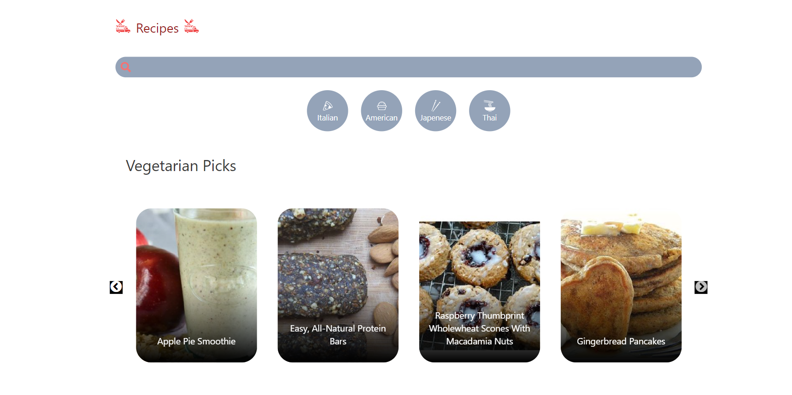

# Recipe App
## Project Description
The Recipe App is a dynamic and interactive web application designed to provide users with a seamless experience in discovering, saving, and sharing recipes. Built with modern web technologies such as React, Vite, Framer Motion, Tailwind CSS, and the Spoonacular API, the app offers a visually appealing and responsive interface that enhances user engagement and satisfaction.

## Live Site: 
[Recipes App](https://cook-with-recipe.netlify.app/)

## Screenshot


## Features
> Recipe Discovery: Search and explore a vast collection of recipes.
> Save Recipes: Save favorite recipes for easy access later.
> Responsive Design: Ensures a seamless experience on all devices.
> Interactive Animations: Smooth and engaging animations powered by Framer Motion.

## Technologies Used
> React: JavaScript library for building the user interface.
> Vite: Next generation frontend tooling for fast and optimized builds.
> Framer Motion: Library for creating animations and gestures.
> Tailwind CSS: Utility-first CSS framework for styling.
> Spoonacular API: API for accessing a wide range of recipes and related data.

## Getting Started
Prerequisites
Node.js
npm (or yarn)

# Installation
Clone the repository:
```bash
Copy code
git clone https://github.com/akdhiman358/recipes_app.git
```
Navigate to the project directory:
```bash
Copy code
cd recipes_app
```
Install dependencies:
```bash
Copy code
npm install
```
or
```bash
Copy code
yarn install
```
Running the Development Server
```bash
Copy code
npm run dev
```
or

```bash
Copy code
yarn dev
```
Open http://localhost:3000 in your browser to see the result.

Building for Production
```bash
Copy code
npm run build
```
or

```bash
Copy code
yarn build
```
Running in Production Mode
After building the project, you can start it in production mode with:

```bash
Copy code
npm start
```
or

```bash
Copy code
yarn start
```
### Deploying
This project can be deployed to any static site hosting service. Netlify is used for the live version.

### Contributing
If you have suggestions for improvements or encounter any issues, feel free to open an issue or submit a pull request.

### Contact
For any inquiries, please reach out to me via akshayud0@gmail.com
